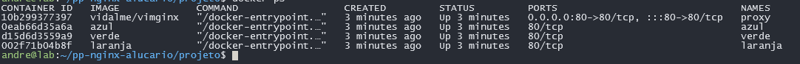
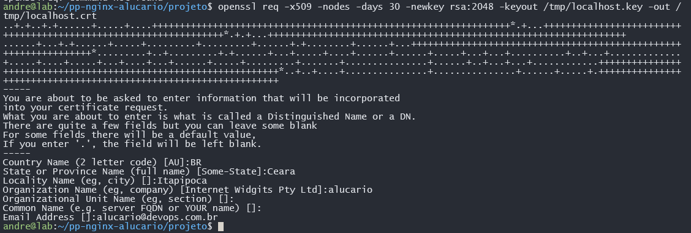

# 2º Projeto Prático - Trilha DevOps
#### Configuração e Otimização do Servidor NGINX
autor: ***Andre Vidal Almeida***

### Funções do NGINX que foram utilizadas no projeto

1. Servidor web HTTP/HTTPS
2. Proxy Reverso
3. API Gateway
4. Otimização de Desempenho
5. Load Balancer
6. Segurança e HTTPS

#### Containers rodando

### Serviços diferentes respondendo a requisição do proxy reverso.

#### Gerando SSL
